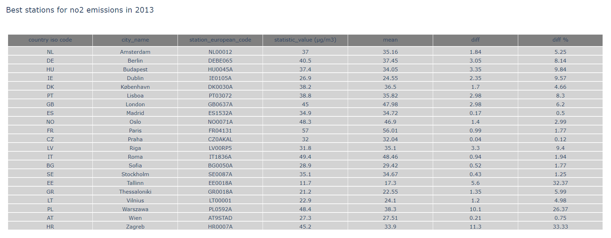
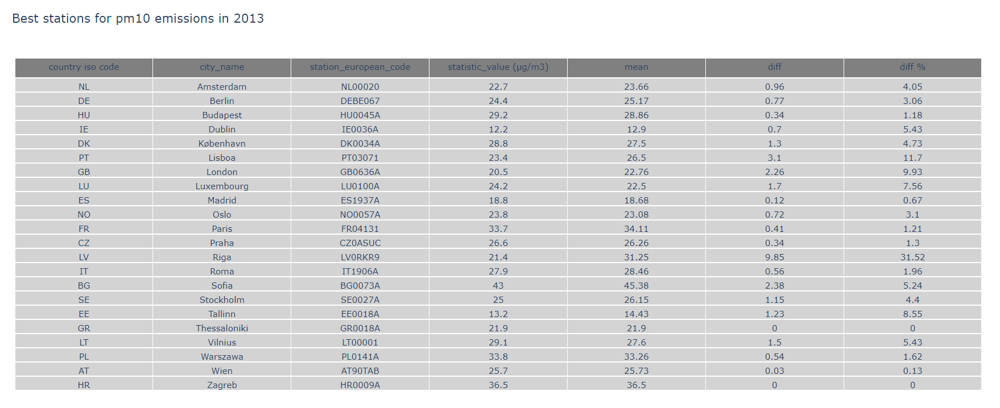
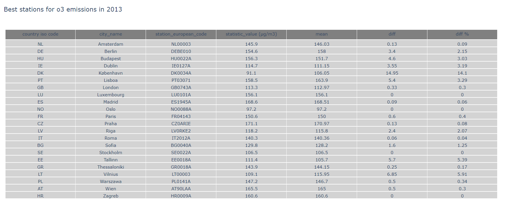

# airpollpy
Project around air pollution in Python

## What is it?
The goal of the project is to retrieve and analyze data from the European Environment Agency.
Initially inspired by this [article](https://www.eea.europa.eu/themes/air/air-quality-and-covid19/air-quality-and-covid19).

## Getting the data
I started retrieving the data for London using the [Bloomsbury monitoring station](https://uk-air.defra.gov.uk/networks/site-info?site_id=CLL2)
which code corresponds to GB0566A in the csv files.
A potential amelioration would be to take the data from all stations for this city and use a mean. However that is **a lot** of data.

## Stations
Comparison of all station data available from a 2013 data set to check the min, mean and max for a city in order to study 
and visualize those numbers before using the main data sets. Potentially it could be doable to select a **best** station 
for a city and pollutant instead of using the full data set.

Vizualisation of the worst, the best and a mean of all measures per cities and pollutant:

Best, as in closest to the mean or unique station in a city per pollutant:

Best station for each pollutant an city:

| City  | NO2  | O3  | PM10  | PM2.5  |
| ------------- | ------------- | ------------- | ------------- | ------------- |
| Amsterdam  | NL00012  | NL00003  | NL00020  | NL00007  |
| Berin  | DEBE065  | DEBE010  | DEBE067  | DEBE068  |
| Budapest  | HU0045A  | HU0022A  | HU0045A  | N/A  |
| Dublin  | IE0105A  | IE0127A  | IE0036A  | IE0028A  |
| København  | DK0030A  | DK0034A  | DK0034A  | DK0034A  |
| Lisboa  | PT03072  | PT03071  | PT03071  | PT03071  |
| London  | GB0637A  | GB0743A  | GB0636A  | GB0636A  |
| Luxembourg  | N/A  | LU0101A  | LU0100A  | N/A  |
| Madrid  | ES1532A  | ES1945A  | ES1937A  | ES1937A  |
| Oslo  | NO0071A  | NO0088A  | NO0057A  | NO0083A  |
| Paris  | FR04131  | FR04143  | FR04131  | FR04143  |
| Praha  | CZ0AKAL  | CZ0ARIE  | CZ0ASUC  | CZ0ALIB  |
| Riga  | LV00RP5  | LV0RKE2  | LV0RKR9  | LV0RKR9  |
| Roma  | IT1836A  | IT2012A  | IT1906A  | IT0957A  |
| Sofia  | BG0050A  | BG0040A  | BG0073A  | BG0050A  |
| Stockholm  | SE0087A  | SE0022A  | SE0027A  | SE0087A  |
| Tallinn  | EE0018A  | EE0018A  | EE0018A  | EE0018A  |
| Thessaloniki  | GR0018A  | GR0018A  | GR0018A  | content  |
| Vilnius  | LT00001  | LT00003  | LT00001  | LT00003  |
| Warszawa  | PL0592A  | PL0141A  | PL0141A  | PL0141A  |
| Wien  | AT9STAD  | AT90LAA  | AT90TAB  | AT90AKC  |
| Zagreb  | HR0007A  | HR0009A  | HR0009A  | N/A  |

## Creating a mean data set per city and pollutant
An issue with the **best station** method: some stations from 2013 don't provide data later. 
Also, a different station could be closer to the mean in later years.
I decided to use the whole data set available and work on it to build a mean for each city and timestamp.
The data in *data/main/cleaned* is available per pollutant, city and then a file per station and year.
The goal is going to be to merge every stations value and average it to a mean for the whhole city concerned.

## Dependencies
- [Pandas](https://pandas.pydata.org/)

## Source:
[European Environment Agency](https://www.eea.europa.eu/) with [creative commons license](https://creativecommons.org/licenses/by/2.5/dk/deed.en_GB)

